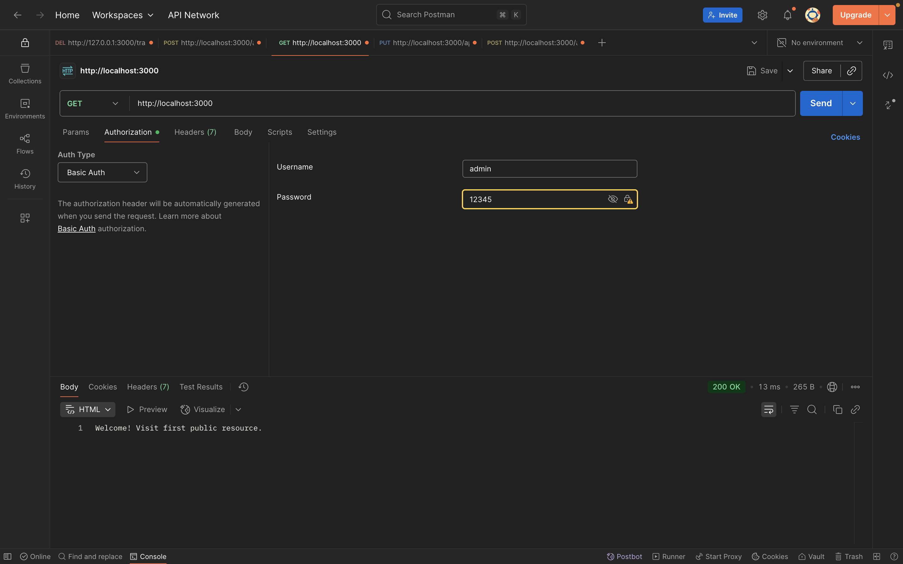
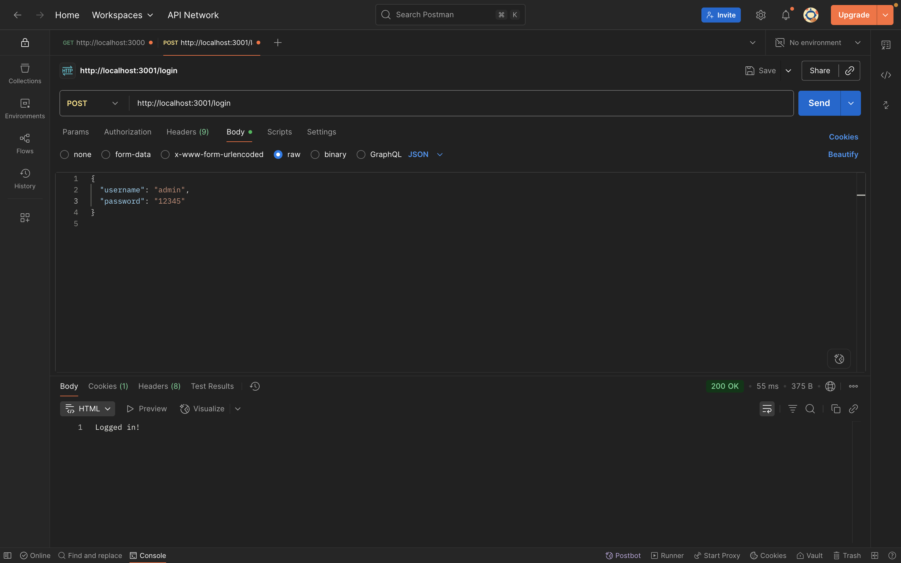
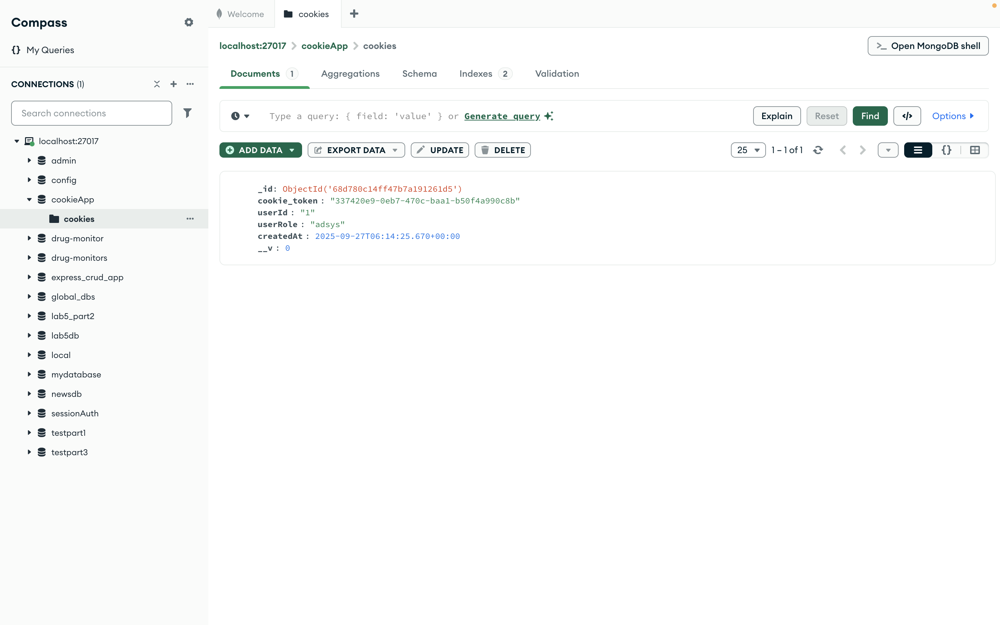

# Simple Authentication

Project này demo cách sử dụng **Basic Auth** và **Cookie Auth** trong Node.js.

## 🚀 Cách chạy project

Cài đặt dependencies:
```bash
npm install
```

Chạy project:
```bash
npm start
```

---

## 1. simple_auth source code

### a. Basic Auth
Chạy:
```bash
node basic_auth.js
```

Kết quả:  


---

### b. Cookie Auth
Chạy:
```bash
node cookie_auth.js
```

Kết quả:  


---

### c. Show cookie trong MongoDB
Kết quả:  

